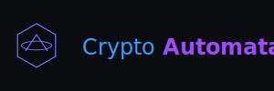

# CryptoAutomata 🌌

<div align="center">




*The future of network visualization and state machine design.*

[Demo](https://cryptoautomata.vercel.app) • [Documentation](#documentation) • [Features](#features) • [Quick Start](#quick-start)

</div>

---

## 🚀 Overview

CryptoAutomata is a cutting-edge network visualization platform that combines state-of-the-art graph theory with futuristic aesthetics. Design complex state machines, visualize network topologies, and bring your ideas to life with our advanced animation system.

## ✨ Features

### 🎯 Core Systems
- **Neural Graph Engine** - Interactive node-based visualization
- **Quantum State Machine** - Advanced state transition system
- **Holographic Canvas** - Dynamic workspace with infinite scaling
- **Temporal Sync** - Real-time state management
- **Pulse Animation Framework** - Smooth, reactive animations

### 🎮 Interface
- **Dark Matter Theme** - Modern, eye-friendly dark interface
- **Neural Controls** - Intuitive node manipulation
- **Quantum Statistics** - Real-time network analytics
- **Version Nexus** - Interactive changelog system

### 🌟 Premium Features
- **Neural Node Themes** - Custom visual styles
- **Quantum Animations** - Advanced node effects
- **Template Forge** - Premium design templates
- **Neural Statistics** - Advanced network metrics
- **Command Center** - Power-user keyboard shortcuts

## 🛠 Quick Start

```bash
# Clone the Neural Network
git clone https://github.com/NubsCarson/CryptoAutomata.git

# Initialize Quantum Core
cd CryptoAutomata
npm install

# Activate Neural Interface
npm start
```

## 📚 Documentation

### System Requirements
- Node.js 16+
- Modern web browser with WebGL support
- 4GB RAM minimum
- GPU with shader support (recommended)

### Command Center
| Command | Action |
|---------|--------|
| `Ctrl + N` | New Node |
| `Ctrl + E` | New Edge |
| `Space` | Toggle Grid |
| `Ctrl + Z` | Time Reverse |
| `Ctrl + Y` | Time Forward |

## 🌌 Deployment Matrix

### ⚡ Vercel Quantum Deployment
```bash
# Initialize Quantum Core
vercel init

# Engage Hyperdrive
vercel deploy
```

### 🔮 Manual Deployment
```bash
# Build Quantum Core
npm run build

# Initialize Neural Network
serve -s build
```

## 🎯 Roadmap

- [x] Quantum Core Implementation
- [x] Neural Network Interface
- [x] Temporal Animation System
- [ ] Quantum State Persistence
- [ ] Neural Cloud Sync
- [ ] Holographic Preview Mode

## 🤝 Contributing

Join our quantum collective:

1. Fork the Neural Network
2. Create your Feature Branch (`git checkout -b feature/AmazingFeature`)
3. Commit your Changes (`git commit -m 'Add some AmazingFeature'`)
4. Push to the Branch (`git push origin feature/AmazingFeature`)
5. Open a Pull Request

## 📜 License

Distributed under the MIT License. See `LICENSE` for more information.

---

<div align="center">

**[Website](https://cryptoautomata.vercel.app)** • **[Documentation](https://docs.cryptoautomata.dev)** • **[Report Bug](https://github.com/NubsCarson/CryptoAutomata/issues)**

Made with ❤️ and quantum technology

</div>
